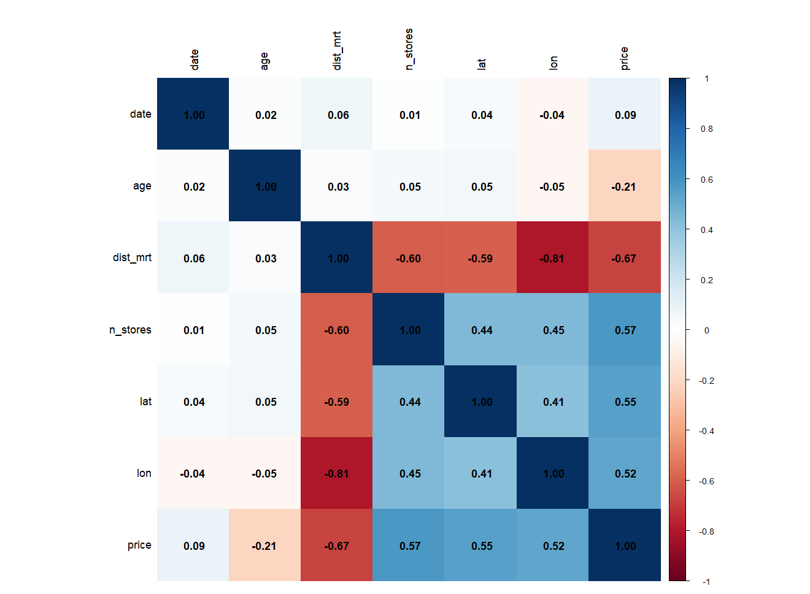
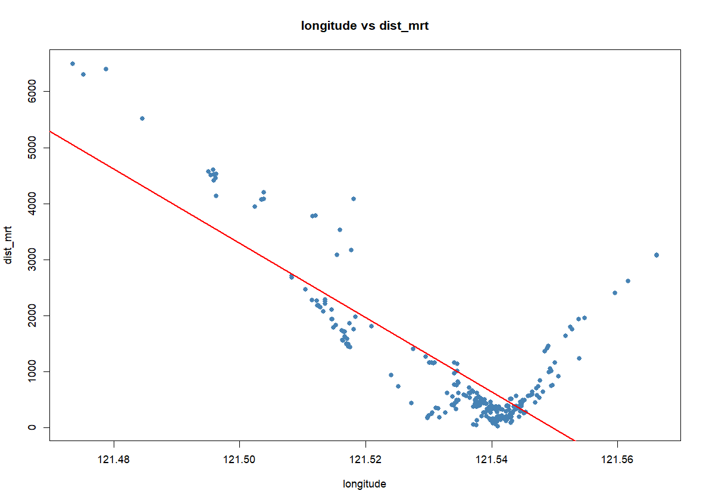
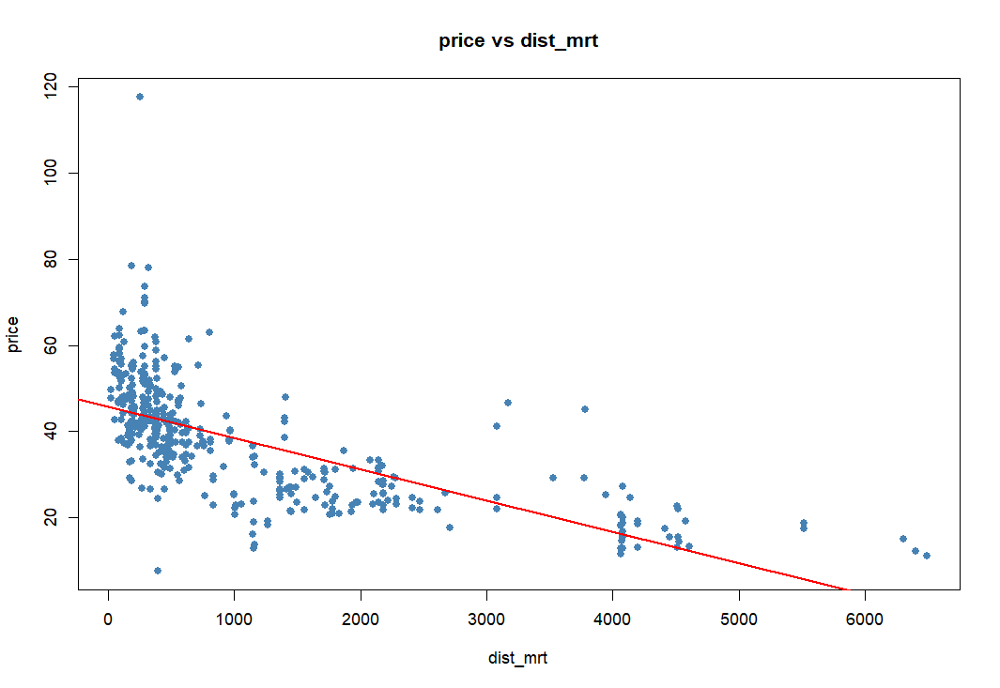
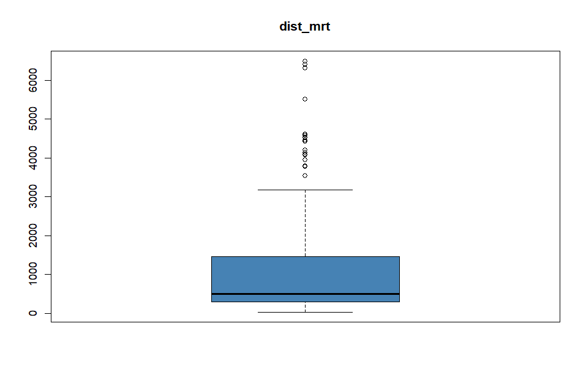
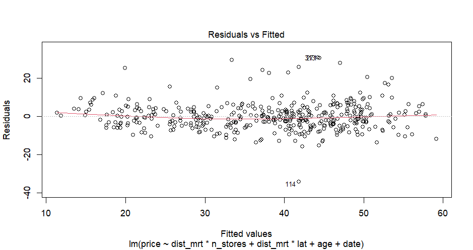
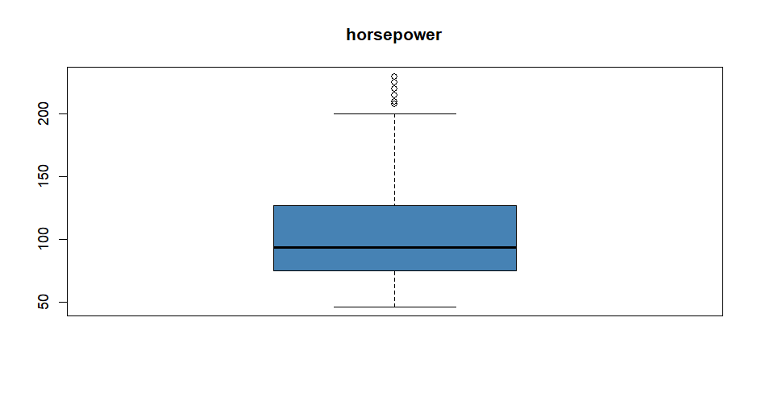
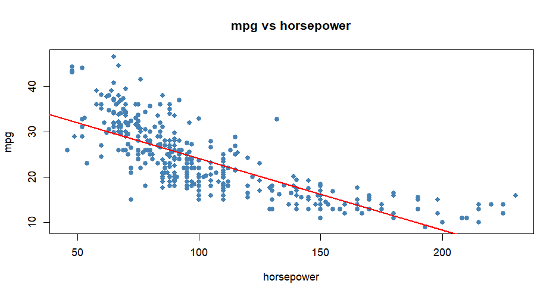
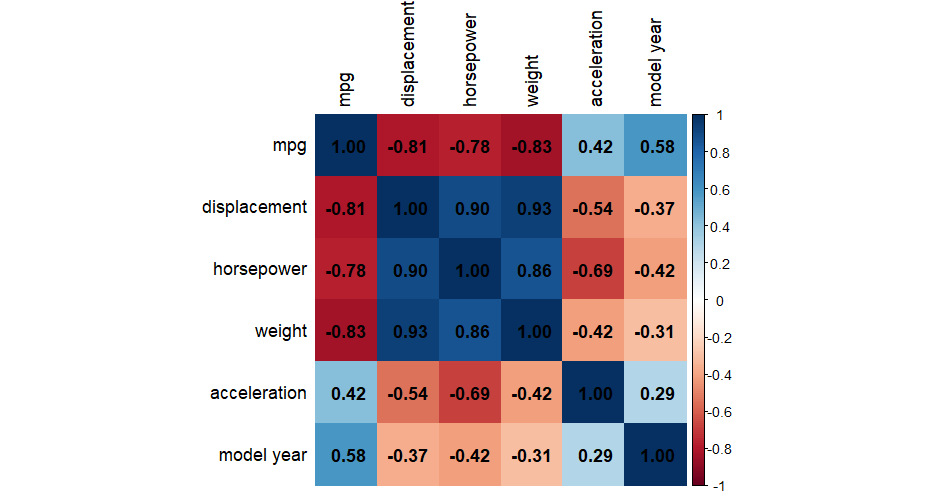
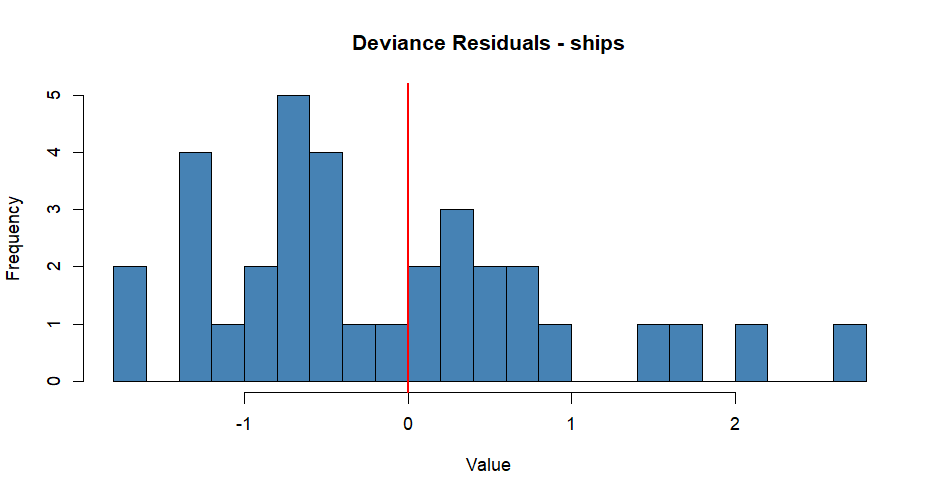
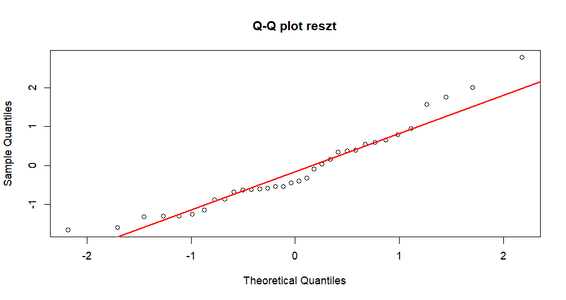

Filip Pawłowicz, 414324

# Zadanie 1

## Zbiór danych Real Estate Valuation.

Podstawowym element pracy z danymi jest ich analiza i selekcja cech. Na początku usunąłem kolumnę zawierającą indeksy - do regresji jest to zbędne. Zmieniłem także nazwy kolumn na prostsze i krótsze.


```r
df <- read_excel("real-estate.xlsx")
dim(df)

head(df)
summary(df)

df$No <- NULL
names(df) <- c("date", "age", "dist_mrt", "n_stores", "lat", "lon", "price")

head(df)
```

Kolejnym krokiem jest sprawdzenie wartości brakujących lub niepoprawnych. Można to bardzo prosto sprawdzić poleceniem `colSums(is.na(df))`. Ten zbiór danych nie zawiera takich wartości, co wskazali również autorzy zbioru. W ogólnósci brak danych w kolumnie możemy naprawić, podstawiając w te miejsca średnią wartość lub mediane. Jeśli w danej kolumnie takich przypadkach jest więcej, to raczej skłaniamy się do usunięcia tej cechy (lub wierszy).

W modelach liniowych dane nie powinny być silnie skorelowane. Poniżej przedstawiam macierz korelacji oraz stworzoną na jej podstawie tzw. heatmap.

```r
cor_matrix <- cor(df)
print(round(cor_matrix, 2))

corrplot(cor_matrix, method = "color", addCoef.col = "black", tl.col = "black")
```

```r
          date   age dist_mrt n_stores   lat   lon price
date      1.00  0.02     0.06     0.01  0.04 -0.04  0.09
age       0.02  1.00     0.03     0.05  0.05 -0.05 -0.21
dist_mrt  0.06  0.03     1.00    -0.60 -0.59 -0.81 -0.67
n_stores  0.01  0.05    -0.60     1.00  0.44  0.45  0.57
lat       0.04  0.05    -0.59     0.44  1.00  0.41  0.55
lon      -0.04 -0.05    -0.81     0.45  0.41  1.00  0.52
price     0.09 -0.21    -0.67     0.57  0.55  0.52  1.00
```



Na przedstawionym obrazie widać dużą korelację między longitude a odległością do najbliższej stacji metra. Zbiór danych dotyczy miasta New Taipei, którego centrum zlokalizowane jest bardziej na zachodzie - tam też skupia się większość stacji.

```r
plot(df$lon, df$dist_mrt, main = "longitude vs dist_mrt",
     xlab = "longitude", ylab = "dist_mrt", col = "steelblue", pch = 16)
abline(lm(dist_mrt ~ lon, data = df), col = "red", lwd = 2)
```



Testem, który służy do sprawdzenia liniowej korelacji danych jest Test Pearsona. W naszym przypadku test zwraca zależność istotnie statystyczną dla podanych cech, ale tylko dla `dist_mrt` i `lon` ta korelacja jest tak duża.

```r
cor.test(df$dist_mrt, df$price)
cor.test(df$n_stores, df$price)
cor.test(df$lat, df$lon)
cor.test(df$dist_mrt, df$lon)
```

Poniżej przedstawiam też przykładowo wykres ceny od odległości do stacji metra. Podobne wykresy wykonałem dla pozostałych cech.
<center>
{width=80%}
</center>

Kolejnym niepożądanym zjawiskiem w modelach liniowych są obserwacje odstające. Wynika to z zastosowania MSE jako funkcji kosztu, która silnie karze duże błędy. W praktyce takie obserwacje powinny być usuwane z danych lub odpowiednio ograniczane, np. poprzez winsoryzację, czyli przycinanie wartości skrajnych do ustalonych progów. Zastosowałem drugą opcję. Poniżej przedstawiam kod do stworzenia wykresów pudełkowów oraz jeden przykładowy.

```r
boxplot(df$price, main = "price", col = "steelblue")
boxplot(df$dist_mrt, main = "dist_mrt", col = "steelblue")
boxplot(df$age, main = "age", col = "steelblue")
boxplot(df$n_stores, main = "age", col = "steelblue")
```


Na powyższym wykresie pudełkowych widać wiele wartości odstających - są domy, które znajdują się bardzo daleko od stacji metra.


```r
winsorize <- function(x) {
  q      <- quantile(x, c(0.25, 0.75))
  iqr    <- q[2] - q[1]
  lower  <- q[1] - 1.5 * iqr
  upper  <- q[2] + 1.5 * iqr
  pmax(pmin(x, upper), lower)
}

df$price    <- winsorize(df$price)
df$dist_mrt <- winsorize(df$dist_mrt)
df$age      <- winsorize(df$age)
```

Stwórzmy teraz model liniowy, sprawdźmy wpływ zmiennych na niego oraz założenia regresji.

```r
model_multi <- lm(price ~ ., data = df)
summary(model_multi)

model_interact <- lm(price ~ dist_mrt * n_stores + dist_mrt * lat + age + date, data = df)
summary(model_interact)

AIC(model_multi, model_interact)
```

Na podstawie kryterium AIC widać, że model z interakcjami troszkę lepiej wyjaśnia dane. Będę go stosować w dalszej analizie. Liniowość sprawdzam wykresem Residuals vs Fitted - reszty powinny być losowo rozrzucone wokół poziomej lini zero, bez żadnego wzorca. U mnie widać lekką krzywą U - powoduje to prawdopodobnie zmienna dist_mrt, która zmienia się dość gwałtownie. Do sprawdzenia autokorelacji cech używam Testu Durbina-Watsona, który sprawdza, czy kolejne reszty są ze sobą skorelowane. Wynik DW jest bliski 2, co oznacza break autokorelacji. Homoskedastyczność testem Breuscha-Pagana - p > 0.05, co oznacza wariancję stałą. Testem Shapiro-Wilka sprawdzam, czy reszty mają rozkład normalny - p < 0.05, więc nie mają.

```r
plot(model_interact, which = 1)

dwtest(model_interact)

bptest(model_interact)

shapiro.test(residuals(model_interact))

```

```r
> dwtest(model_interact)

	Durbin-Watson test

data:  model_interact
DW = 2.1413, p-value = 0.9258
alternative hypothesis: true autocorrelation is greater than 0

> bptest(model_interact)

	studentized Breusch-Pagan test

data:  model_interact
BP = 13.287, df = 7, p-value = 0.06541

> shapiro.test(residuals(model_interact))

	Shapiro-Wilk normality test

data:  residuals(model_interact)
W = 0.92943, p-value = 4.543e-13
```




## Zbiór danych Auto-MPG
Dla tego modelu wykonałem podobne operacje. Analiza cech, zamiana zmiennych numerycznych na kategoryczne ('origin' i 'cylinders') oraz sprawdzenie pustych wartości w kolumnach.

```r
library(readr)
library(corrplot)
library(lmtest)

df <- read_csv("auto-mpg.csv", na = "?")
dim(df)
head(df)
summary(df)
str(df)
df$`car name` <- NULL

df$origin    <- factor(df$origin)
df$cylinders <- factor(df$cylinders)

colSums(is.na(df))

df <- na.omit(df)
```

Przedstawiam też kod do rysowania wykresów pudełkowych oraz zależności między zmiennymi, wstawiam przykładowe:





```r
boxplot(df$mpg,          main = "mpg",          col = "steelblue")
boxplot(df$displacement, main = "displacement",  col = "steelblue")
boxplot(df$horsepower,   main = "horsepower",    col = "steelblue")
boxplot(df$weight,       main = "weight",        col = "steelblue")
boxplot(df$acceleration, main = "acceleration",  col = "steelblue")

plot(df$weight, df$mpg, main = "mpg vs weight",
     xlab = "weight", ylab = "mpg", col = "steelblue", pch = 16)
abline(lm(mpg ~ weight, data = df), col = "red", lwd = 2)

plot(df$horsepower, df$mpg, main = "mpg vs horsepower",
     xlab = "horsepower", ylab = "mpg", col = "steelblue", pch = 16)
abline(lm(mpg ~ horsepower, data = df), col = "red", lwd = 2)

plot(df$displacement, df$mpg, main = "mpg vs displacement",
     xlab = "displacement", ylab = "mpg", col = "steelblue", pch = 16)
abline(lm(mpg ~ displacement, data = df), col = "red", lwd = 2)
```



```r
> print(round(cor_matrix, 2))
               mpg displacement horsepower weight acceleration model year
mpg           1.00        -0.81      -0.78  -0.83         0.42       0.58
displacement -0.81         1.00       0.90   0.93        -0.54      -0.37
horsepower   -0.78         0.90       1.00   0.86        -0.69      -0.42
weight       -0.83         0.93       0.86   1.00        -0.42      -0.31
acceleration  0.42        -0.54      -0.69  -0.42         1.00       0.29
model year    0.58        -0.37      -0.42  -0.31         0.29       1.00
```
Widać pewne ujemne korelacji, ale nie ma żadnej >0.9, więc nie będe usuwać żadnej cechy. Na wykresie pudełkowym `horsepower` widać kilka outlierów, więc w tym zbiorze jest trochę takich wierszy - dokonam także winsoryzacji.

```r
> summary(model_multi)

Call:
lm(formula = mpg ~ displacement + horsepower + weight + acceleration +
    `model year` + origin, data = df)

Residuals:
    Min      1Q  Median      3Q     Max
-8.7347 -2.1205 -0.0653  1.9576 13.2773

Coefficients:
               Estimate Std. Error t value Pr(>|t|)
(Intercept)  -1.806e+01  4.663e+00  -3.873 0.000126 ***
displacement  1.685e-02  5.777e-03   2.918 0.003734 **
horsepower   -2.424e-02  1.487e-02  -1.631 0.103744
weight       -6.611e-03  6.756e-04  -9.785  < 2e-16 ***
acceleration  4.918e-02  1.013e-01   0.485 0.627624
`model year`  7.719e-01  5.193e-02  14.864  < 2e-16 ***
origin2       2.615e+00  5.645e-01   4.632 4.98e-06 ***
origin3       2.825e+00  5.494e-01   5.142 4.33e-07 ***
---
Signif. codes:  0 ‘***’ 0.001 ‘**’ 0.01 ‘*’ 0.05 ‘.’ 0.1 ‘ ’ 1

Residual standard error: 3.306 on 384 degrees of freedom
Multiple R-squared:  0.8237,	Adjusted R-squared:  0.8205
F-statistic: 256.4 on 7 and 384 DF,  p-value: < 2.2e-16

>
> model_interact <- lm(mpg ~ weight * horsepower + displacement +
+                        acceleration + `model year` + origin,
+                      data = df)
> summary(model_interact)

Call:
lm(formula = mpg ~ weight * horsepower + displacement + acceleration +
    `model year` + origin, data = df)

Residuals:
    Min      1Q  Median      3Q     Max
-8.1670 -1.6483 -0.1109  1.6162 12.2015

Coefficients:
                    Estimate Std. Error t value Pr(>|t|)
(Intercept)        2.544e+00  4.541e+00   0.560 0.575684
weight            -1.136e-02  7.443e-04 -15.260  < 2e-16 ***
horsepower        -2.366e-01  2.391e-02  -9.892  < 2e-16 ***
displacement       7.929e-03  5.154e-03   1.538 0.124825
acceleration      -1.018e-01  9.031e-02  -1.128 0.260158
`model year`       7.872e-01  4.574e-02  17.212  < 2e-16 ***
origin2            1.686e+00  5.046e-01   3.342 0.000914 ***
origin3            1.663e+00  4.959e-01   3.354 0.000875 ***
weight:horsepower  5.611e-05  5.290e-06  10.608  < 2e-16 ***
---
Signif. codes:  0 ‘***’ 0.001 ‘**’ 0.01 ‘*’ 0.05 ‘.’ 0.1 ‘ ’ 1

Residual standard error: 2.911 on 383 degrees of freedom
Multiple R-squared:  0.8638,	Adjusted R-squared:  0.8609
F-statistic: 303.6 on 8 and 383 DF,  p-value: < 2.2e-16
```

Dla modelu pełnego istotne zmienne to `weight`, `model year` oraz `origin` - natomiast `horsepower` i `acceleration` okazały się nieistotne.

Model z interakcją `weight * horsepower` poprawia dopasowanie. Interakcja jest bardzo istotna (p < 2e-16), co oznacza że wpływ masy na MPG zależy od mocy silnika - w ciężkich autach z dużą mocą efekt jest inny niż w lekkich. Dodatkowo `horsepower` staje się istotny dopiero gdy uwzględnimy jego interakcję z `weight`. `displacement` i `acceleration` pozostają nieistotne w obu modelach.

Na podstawie kryterium AIC model z interakcją jest lepszy i to jego używam w dalszej analizie.

```r
AIC(model_multi, model_interact)

plot(model_interact, which = 1)

dwtest(model_interact)

bptest(model_interact)

shapiro.test(residuals(model_interact))
```

Liniowość sprawdzam wykresem Residuals vs Fitted - widać lekką krzywą, podobnie jak w zbiorze Real Estate, co sugeruje nieliniową zależność niektórych predyktorów od MPG.

Test Durbina-Watsona daje DW = 1.475, p < 0.001, co oznacza obecność dodatniej autokorelacji reszt. Jest to prawdopodobnie spowodowane tym że dane są uporządkowane chronologicznie - samochody z podobnych lat mają podobne MPG.

Test Breuscha-Pagana daje p < 0.001, co oznacza heteroskedastyczność - wariancja reszt nie jest stała. Może to wynikać z tego że model lepiej przewiduje MPG dla aut o średnim spalaniu niż dla skrajnych wartości.

Test Shapiro-Wilka daje p < 0.001, co oznacza że reszty nie mają rozkładu normalnego.

Wszystkie trzy założenia są naruszone.

# Regresja Poissonowska

## Funkcja wiarygodności dla regresji Poissonowskiej

### Zadanie 1

Dla pojedynczej obserwacji $y_i$, prawdopodobieństwo że przyjmie ona wartość $y_i$ wynosi:
$$P(Y_i = y_i) = \frac{\lambda_i^{y_i} \cdot e^{-\lambda_i}}{y_i!}$$
gdzie $\lambda_i$ to oczekiwana liczba zdarzeń dla obserwacji $i$.


Zakładamy że wszystkie $n$ obserwacji są niezależne, więc łączne prawdopodobieństwo to iloczyn:
$$L(a_0, a_1, \ldots, a_p) = \prod_{i=1}^{n} \frac{\lambda_i^{y_i} \cdot e^{-\lambda_i}}{y_i!}$$

Z założenia:

$$\log(\lambda_i) = a_0 + a_1 X_{i1} + \cdots + a_p X_{ip}$$

czyli:

$$\lambda_i = e^{a_0 + a_1 X_{i1} + \cdots + a_p X_{ip}}$$


$$L(a_0, \ldots, a_p) = \prod_{i=1}^{n} \frac{\left(e^{a_0 + a_1 X_{i1} + \cdots + a_p X_{ip}}\right)^{y_i} \cdot e^{-e^{a_0 + a_1 X_{i1} + \cdots + a_p X_{ip}}}}{y_i!}$$


Maksymalizujemy logarytm funkcji wiarygodności:

$$\ell(a_0, \ldots, a_p) = \sum_{i=1}^{n} \left[ y_i \cdot (a_0 + a_1 X_{i1} + \cdots + a_p X_{ip}) - e^{a_0 + a_1 X_{i1} + \cdots + a_p X_{ip}} - \log(y_i!) \right]$$

Niech $\eta_i = a_0 + a_1 X_{i1} + \cdots + a_p X_{ip}$, otrzymujemy postać skróconą:

$$\ell = \sum_{i=1}^{n} \left[ y_i \cdot \eta_i - e^{\eta_i} - \log(y_i!) \right]$$

Czynnik $\log(y_i!)$ można pominąć - nie zależy od parametrów.

### Zadanie 2

```r
df <- read.table("poisson.data", header = TRUE, sep = ";", dec = ",")

head(df)
summary(df)
dim(df)


likelihood <- function(params, y, x) {
  a0     <- params[1]
  a1     <- params[2]
  eta    <- a0 + a1 * x
  lambda <- exp(eta)
  nll    <- -sum(y * eta - lambda)
  return(nll)
}

names(df)
y <- df$Y
x <- df$X1

result <- optim(par = c(0, 0), fn = likelihood, y = y, x = x)

a0_optim <- result$par[1]
a1_optim <- result$par[2]

cat("a0 (intercept):", a0_optim, "\n")
cat("a1 (slope)    :", a1_optim, "\n")

model_poisson <- glm(y ~ x, data = df, family = poisson)
summary(model_poisson)
```

a) Deviance Residuals to taki odpowiednik reszt z regresji liniowej, ale dla modeli GLM. Mierzy, jak bardzo każda z obserwacji odstaje od wartości przewidywanej przez model. Liczy się to trochę bardziej skomplikowanym wzorem. W moim p rzypadku prawie wszystkie wartości mieszczą się w przedziale (-2, 2), co oznacza, że model jest dobrze dopasowany.

```r
dev_res <- residuals(model_poisson, type = "deviance")
summary(dev_res)

  Min.  1st Qu.   Median     Mean  3rd Qu.     Max.
-2.14713 -0.69081  0.08003 -0.02299  0.55972  2.80599
```

b) Z podsumowania modelu widać, że oba współczynniki mają '***', więc są istotne. Wartości współczynników są takie same, jak te uzyskane przez funkcję optim, gdyż optymalizują tę samą funkcję wiarygodności, róznią się tylko algorytmem.

```
glm(formula = y ~ x, family = poisson, data = df)

Coefficients:
            Estimate Std. Error z value Pr(>|z|)
(Intercept) 1.032997   0.051017   20.25   <2e-16 ***
x           0.497547   0.006194   80.33   <2e-16 ***
---
Signif. codes:  0 ‘***’ 0.001 ‘**’ 0.01 ‘*’ 0.05 ‘.’ 0.1 ‘ ’ 1
```

c) Null Deviance to przewidywanie każdej obserwacji tylko średnią ze wszystkich $y$, bez brania pod uwagę predykatora $x$. Residual deviance to już przewidywanie z braniem predykatora. W moim przypadku residual deviance jest znacznie mniejszy od null deviance, co oznacza, że zmienna $x$ bardzo dużo wyjaśnia.

```r
Null deviance: 9945.17  on 99  degrees of freedom
Residual deviance:  101.89  on 98  degrees of freedom
```

# Zadanie 3

W tym przypadku będe modelować częstosć wypadków, czyli liczbę wypadków na jednostkę czasu, a nie samą liczbę wypadków, ze względu na zmienną objaśniająca `period`. Gdy statek jest dłużej eksploatowany, to może mieć więcej wypadków. `period` będzie stanowić tzw. offset w regresji Poissonowskiej.

Zwróćmy też uwage, że zmienne year, period, type to tak naprawdę zmienne kategoryczne, a model potraktuje je jako wartości ciągłe. Wartości tej cechy to po prostu kategorie: 65 oznacza pewien zakres (65-70), a nie konkretną liczbę. W tym celu zamieniamy te zmienne na wartości kategoryczne, stosując One Hot Encoding.

```r
library(MASS)
data("ships")

head(ships)
summary(ships)
str(ships)

names(ships)

ships$type   <- factor(ships$type)
ships$year   <- factor(ships$year)
ships$period <- factor(ships$period)

ships_df <- subset(ships, service > 0)

model_ships <- glm(incidents ~ type + year + period + offset(log(service)), data = ships_df, family = poisson)

summary(model_ships)
```
```r
> summary(ships)
 type  year    period     service          incidents
 A:8   60:10   60:20   Min.   :    0.0   Min.   : 0.0
 B:8   65:10   75:20   1st Qu.:  175.8   1st Qu.: 0.0
 C:8   70:10           Median :  782.0   Median : 2.0
 D:8   75:10           Mean   : 4089.3   Mean   : 8.9
 E:8                   3rd Qu.: 2078.5   3rd Qu.:11.0
                       Max.   :44882.0   Max.   :58.0
```

Z podsumowania modelu widać, że program poprawnie potraktował year i period jako zmienne kategoryczne (osobne zmienne).
```r
> summary(model_ships)

Call:
glm(formula = incidents ~ type + year + period + offset(log(service)),
    family = poisson, data = ships_df)

Coefficients:
            Estimate Std. Error z value Pr(>|z|)
(Intercept) -6.40590    0.21744 -29.460  < 2e-16 ***
typeB       -0.54334    0.17759  -3.060  0.00222 **
typeC       -0.68740    0.32904  -2.089  0.03670 *
typeD       -0.07596    0.29058  -0.261  0.79377
typeE        0.32558    0.23588   1.380  0.16750
year65       0.69714    0.14964   4.659 3.18e-06 ***
year70       0.81843    0.16977   4.821 1.43e-06 ***
year75       0.45343    0.23317   1.945  0.05182 .
period75     0.38447    0.11827   3.251  0.00115 **
---
Signif. codes:  0 ‘***’ 0.001 ‘**’ 0.01 ‘*’ 0.05 ‘.’ 0.1 ‘ ’ 1

(Dispersion parameter for poisson family taken to be 1)

    Null deviance: 146.328  on 33  degrees of freedom
Residual deviance:  38.695  on 25  degrees of freedom
AIC: 154.56

Number of Fisher Scoring iterations: 5
```

```r
dev_res <- resid(model_ships, type = "deviance")

hist(dev_res, breaks = 20, col = "steelblue",
     main = "Deviance Residuals - ships",
     xlab = "Value")
abline(v = 0, col = "red", lwd = 2)

qqnorm(dev_res, main = "Q-Q plot residuals")
qqline(dev_res, col = "red", lwd = 2)

shapiro.test(dev_res)
```

```r
	Shapiro-Wilk normality test

data:  dev_res
W = 0.94061, p-value = 0.06427
```





Tak, jest spełnione załóżenie reszt dot. ich normalności, co potwierdza Test Shapiro-Wilka.

# Zadanie 4

Podobnie, jak powyżej, mamy doczynienia z danymi kategorycznymi oraz zmienną `ncontrols` - liczba osób zdrowych, która będzie służyć, jako offset. Przekształciłem je na odpowiednie typy, dokonałem też pewnej selekcji i inżynieri cech, biorąc tylko wiersze z `ncases` i `ncontrols`, które są dodatnie.

```r
library(ISwR)
data("esoph")

esoph_df <- esoph

head(esoph_df)
summary(esoph_df)
sum(esoph_df$ncontrols == 0)
sum(is.na(esoph_df$ncontrols))

esoph_df$agegp <- factor(esoph_df$agegp, ordered = FALSE)
esoph_df$alcgp <- factor(esoph_df$alcgp, ordered = FALSE)
esoph_df$tobgp <- factor(esoph_df$tobgp, ordered = FALSE)

esoph_df <- subset(esoph_df, ncontrols > 0)
esoph_df <- subset(esoph_df, ncases > 0)

model_esoph <- glm(ncases ~ agegp + alcgp + tobgp + offset(log(ncontrols)),
  data = esoph_df,
  family = poisson
)

summary(model_esoph)
```

```r
glm(formula = ncases ~ agegp + alcgp + tobgp + offset(log(ncontrols)),
    family = poisson, data = esoph_df)

Coefficients:
            Estimate Std. Error z value Pr(>|z|)
(Intercept)  -3.3022     0.4119  -8.016 1.09e-15 ***
agegp45-54    0.5943     0.3867   1.537   0.1243
agegp55-64    1.0250     0.3660   2.801   0.0051 **
agegp65-74    1.5020     0.3775   3.979 6.92e-05 ***
agegp75+      1.3086     0.5302   2.468   0.0136 *
alcgp40-79    1.1816     0.2289   5.162 2.44e-07 ***
alcgp80-119   1.6485     0.2534   6.504 7.81e-11 ***
alcgp120+     2.6987     0.2730   9.885  < 2e-16 ***
tobgp10-19    0.3503     0.1843   1.900   0.0574 .
tobgp20-29    0.4985     0.2210   2.255   0.0241 *
tobgp30+      1.5767     0.2642   5.968 2.40e-09 ***
---
Signif. codes:  0 ‘***’ 0.001 ‘**’ 0.01 ‘*’ 0.05 ‘.’ 0.1 ‘ ’ 1

(Dispersion parameter for poisson family taken to be 1)

    Null deviance: 221.899  on 46  degrees of freedom
Residual deviance:  54.769  on 36  degrees of freedom
AIC: 218.06

Number of Fisher Scoring iterations: 5
```

Na podstawie podsumowania modelu widać, że niektóre zmienne nie są istotne. Istotnymi zmiennymi są min. 'agegp65', 'alcgp40', 'alcgp80', 'alcgp120' i 'tobgp30'. Stworzę teraz model, biorąc tylko najistotniejsze zmienne.

```r
model_esoph2 <- glm(ncases ~ alcgp + tobgp + offset(log(ncontrols)), data = esoph_df, family = poisson)

summary(model_esoph2)

AIC(model_esoph, model_esoph2)
```

```r
> AIC(model_esoph, model_esoph2)
             df      AIC
model_esoph  11 218.0587
model_esoph2  7 238.6873
```

AIC pełnego modelu jest mniejszy, co oznacza, że model pełny jest lepszy. Oznacz to, mimo, że niektóre poziomy 'agegp' są nieostotne, zmienna jako całość poprawia model - jej usunięcie pogarsza dopasowanie.

```r
dev_res <- resid(model_esoph, type = "deviance")
summary(dev_res)
shapiro.test(dev_res)
```

```r
> summary(dev_res)
     Min.   1st Qu.    Median      Mean   3rd Qu.      Max.
-2.093117 -0.870512 -0.005934  0.051550  0.845322  2.312533
>
> shapiro.test(dev_res)

	Shapiro-Wilk normality test

data:  dev_res
W = 0.97393, p-value = 0.3708
```

Deviance Residuals przyjmują wartości w przedziale (-2.09, 2.31), czyli wszystkie mieszczą się w bezpiecznym przedziale (-3, 3). Mediana i średnia są praktycznie równe zero, co świadczy o symetrycznym rozkładzie reszt bez wyraźnego wzorca.

Test Shapiro-Wilka dał wynik W = 0.974, p = 0.371. Ponieważ p > 0.05, nie ma podstaw do odrzucenia hipotezy zerowej o normalności reszt - reszty mają rozkład normalny.

Oba wyniki potwierdzają że model jest dobrze dopasowany do danych.

# Zadanie 5

```r
library(ordinal)

df <- read.csv("clm.data", header = TRUE)

df$id <- NULL
df$satysfakcja <- factor(df$satysfakcja, ordered = TRUE)

str(df)
summary(df)

model_clm <- clm(satysfakcja ~ cena + obsluga, data = df)

summary(model_clm)
```

Wyniki prezentują się następująco. Okazuje się, że żadna zmienna nie jest istotna (obie p > 0.05). Oznacza to, że ani cena, ani obsługa nie mają istotnego wpływu na poziom satysfakcji. Wagi są bliskie zero.
```r
> summary(df)
 satysfakcja      cena           obsluga
 1:21        Min.   : 50.95   Min.   : 1.00
 2:20        1st Qu.: 92.07   1st Qu.: 3.00
 3:23        Median :127.36   Median : 5.00
 4:17        Mean   :127.81   Mean   : 5.53
 5:19        3rd Qu.:159.07   3rd Qu.: 9.00
             Max.   :197.85   Max.   :10.00

> summary(model_clm)
formula: satysfakcja ~ cena + obsluga
data:    df

 link  threshold nobs logLik  AIC    niter max.grad cond.H
 logit flexible  100  -159.66 331.31 4(0)  1.69e-12 1.2e+06

Coefficients:
         Estimate Std. Error z value Pr(>|z|)
cena    -0.005178   0.004391  -1.179    0.238
obsluga  0.014197   0.058268   0.244    0.808

Threshold coefficients:
     Estimate Std. Error z value
1|2 -1.926818   0.748672  -2.574
2|3 -0.953354   0.730469  -1.305
3|4 -0.001363   0.719511  -0.002
4|5  0.879775   0.725654   1.212
```

Widać także progi ('threshold coefficients'). Są to granice między kolejnymi kategoriami satysfakcji. Podsumowując, model jest słabo dopasowany - żadna zmienna nie jest istotna.

# Zadanie 6

```r
data(wine, package = "ordinal")

head(wine)
summary(wine)

model_wine <- clm(rating ~ response + temp + contact, data = wine)
summary(model_wine)

cor(as.numeric(wine$rating), wine$response)

model_wine <- clm(rating ~ temp + contact, data = wine)
summary(model_wine)
```

Model zbudowałem na atrybutach `temp` i `contact` - pominięto `response`, ponieważ jest silnie skorelowany z `rating` (rating to skategoryzowana wersja response), co powodowało osobliwość macierzy Hessiana i problemy z estymacją.

Obie zmienne okazały się istotne. `tempwarm` oznacza że ciepłe wino ma znacznie wyższe prawdopodobieństwo uzyskania wyższego ratingu. `contactyes` oznacza że kontakt z korkiem zwiększa prawdopodobieństwo wyższego ratingu. Progi rosną monotonicznie od -1.344 do 5.006, przy czym duże odstępy między progami 3|4 i 4|5 wskazują że przejście do wyższych kategorii jest trudniejsze.

Przekształciłem ratingu na zmienną binarną (wartości < 4 jako 0, wartości >= 4 jako 1) i stworzyłem dwie regresje. Współczynniki przy predyktorach są identyczne:

- `tempwarm`: 3.0312 w obu modelach
- `contactyes`: 1.8102 w obu modelach

Różnica pojawia się tylko w intercepcie - CLM zapisuje go jako próg `0|1 = 4.072`, regresja logistyczna jako `(Intercept) = -4.072`. Odwrotny znak wynika z tego że modele pracują w przeciwnych kierunkach: CLM modeluje P(Y <= kategorii), a regresja logistyczna P(Y = 1).

Gdy zmienna zależna ma tylko dwie kategorie, oba modele są matematycznie równoważne. CLM ma przewagę gdy kategorii jest więcej niż dwie - wtedy regresja logistyczna nie wystarczy.

```r
wine$rating_binary <- ifelse(as.numeric(wine$rating) < 4, 0, 1)

table(wine$rating_binary)

wine$rating_binary_factor <- factor(wine$rating_binary, ordered = TRUE)

model_clm_binary <- clm(rating_binary_factor ~ temp + contact, data = wine)
summary(model_clm_binary)

model_logit <- glm(rating_binary ~ temp + contact, data = wine, family = binomial)
summary(model_logit)

cat("CLM coefficients:\n")
coef(model_clm_binary)

cat("\nLogistic coefficients:\n")
coef(model_logit)
```

```r
> summary(model_clm_binary)
formula: rating_binary_factor ~ temp + contact
data:    wine

 link  threshold nobs logLik AIC   niter max.grad cond.H
 logit flexible  72   -28.73 63.46 6(0)  3.21e-12 3.1e+01

Coefficients:
           Estimate Std. Error z value Pr(>|z|)
tempwarm     3.0312     0.8525   3.556 0.000377 ***
contactyes   1.8102     0.6927   2.613 0.008964 **
---
Signif. codes:  0 ‘***’ 0.001 ‘**’ 0.01 ‘*’ 0.05 ‘.’ 0.1 ‘ ’ 1

Threshold coefficients:
    Estimate Std. Error z value
0|1   4.0719     0.9393   4.335
>
> model_logit <- glm(rating_binary ~ temp + contact, data = wine, family = binomial)
> summary(model_logit)

Call:
glm(formula = rating_binary ~ temp + contact, family = binomial,
    data = wine)

Coefficients:
            Estimate Std. Error z value Pr(>|z|)
(Intercept)  -4.0719     0.9392  -4.335 1.45e-05 ***
tempwarm      3.0312     0.8525   3.556 0.000377 ***
contactyes    1.8102     0.6927   2.613 0.008963 **
---
Signif. codes:  0 ‘***’ 0.001 ‘**’ 0.01 ‘*’ 0.05 ‘.’ 0.1 ‘ ’ 1

(Dispersion parameter for binomial family taken to be 1)

    Null deviance: 83.100  on 71  degrees of freedom
Residual deviance: 57.457  on 69  degrees of freedom
AIC: 63.457

Number of Fisher Scoring iterations: 5

>
> cat("CLM coefficients:\n")
CLM coefficients:
> coef(model_clm_binary)
       0|1   tempwarm contactyes
  4.071873   3.031189   1.810247
>
> cat("\nLogistic coefficients:\n")

Logistic coefficients:
> coef(model_logit)
(Intercept)    tempwarm  contactyes
  -4.071873    3.031189    1.810247
```

# Wzory, miary

## Słownik miar i statystyk


### AIC (Akaike Information Criterion)

$$AIC = 2k - 2\ln(L)$$

gdzie $k$ to liczba parametrów modelu, a $L$ to wartość funkcji wiarygodności. Służy do porównywania modeli - im niższe AIC tym lepszy model. Kara za liczbę parametrów zapobiega przeuczeniu.

---

### Test korelacji Pearsona

$$r = \frac{\sum(x_i - \bar{x})(y_i - \bar{y})}{\sqrt{\sum(x_i - \bar{x})^2 \sum(y_i - \bar{y})^2}}$$

Mierzy siłę liniowej zależności między dwiema zmiennymi. Wartości od -1 do 1 - im bliżej -1 lub 1 tym silniejsza zależność. Test sprawdza czy korelacja jest istotnie różna od zera (H0: r = 0).

---

### Test Shapiro-Wilka

$$W = \frac{\left(\sum_{i=1}^{n} a_i x_{(i)}\right)^2}{\sum_{i=1}^{n}(x_i - \bar{x})^2}$$

Sprawdza czy dane mają rozkład normalny. H0: dane są normalne. Jeśli p > 0.05 - brak podstaw do odrzucenia normalności.

---

### Test Durbina-Watsona

$$DW = \frac{\sum_{i=2}^{n}(e_i - e_{i-1})^2}{\sum_{i=1}^{n} e_i^2}$$

Sprawdza autokorelację reszt. Wartość bliska 2 oznacza brak autokorelacji. Wartość bliska 0 to dodatnia autokorelacja, bliska 4 to ujemna autokorelacja.

---

### Test Breuscha-Pagana

Sprawdza homoskedastyczność - czy wariancja reszt jest stała. H0: wariancja jest stała (homoskedastyczność). Jeśli p < 0.05 - wariancja nie jest stała (heteroskedastyczność).

$$BP = n \cdot R^2_{reszt}$$

gdzie $R^2_{reszt}$ pochodzi z regresji kwadratów reszt na zmienne objaśniające.

---

### Deviance Residuals (reszty dewiancji)

$$d_i = \text{sign}(y_i - \hat{\lambda}_i) \cdot \sqrt{2\left[y_i \log\frac{y_i}{\hat{\lambda}_i} - (y_i - \hat{\lambda}_i)\right]}$$

Odpowiednik zwykłych reszt dla modeli GLM. Większość wartości powinna mieścić się w przedziale (-2, 2). Wartości powyżej 3 lub poniżej -3 sygnalizują problematyczne obserwacje.

---

### Null deviance i Residual deviance

$$D = 2\left[\ell(\text{model saturowany}) - \ell(\text{model})\right]$$

Null deviance mierzy dopasowanie modelu bez żadnych predyktorów (tylko średnia). Residual deviance mierzy dopasowanie naszego modelu. Im większa różnica między nimi tym więcej zmienności wyjaśniają predyktory. Residual deviance zbliżona do liczby stopni swobody świadczy o dobrym dopasowaniu.

---

### Log-funkcja wiarygodności (dla regresji Poissonowskiej)

$$\ell = \sum_{i=1}^{n}\left[y_i \cdot \eta_i - e^{\eta_i} - \log(y_i!)\right]$$

gdzie $\eta_i = a_0 + a_1X_{i1} + \cdots + a_pX_{ip}$ to predyktor liniowy. Maksymalizacja tej funkcji daje optymalne parametry modelu.